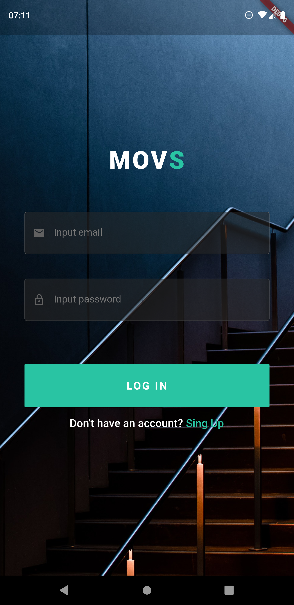
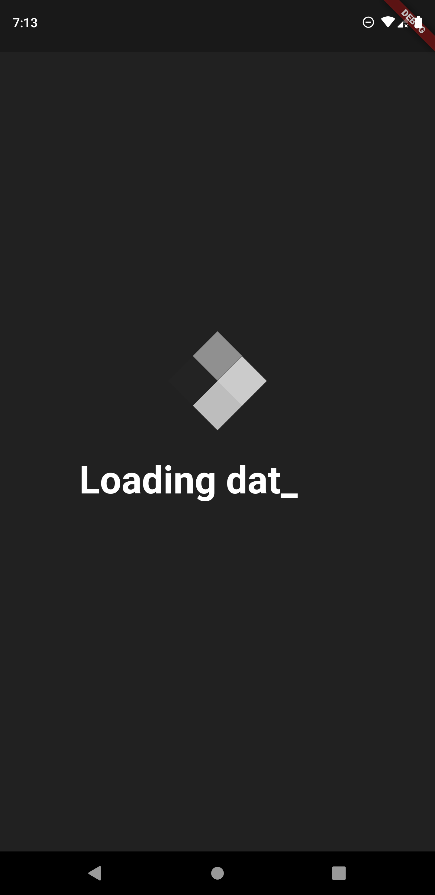
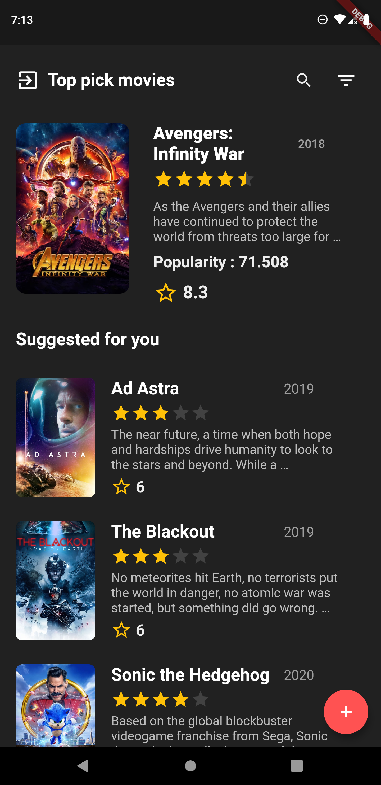
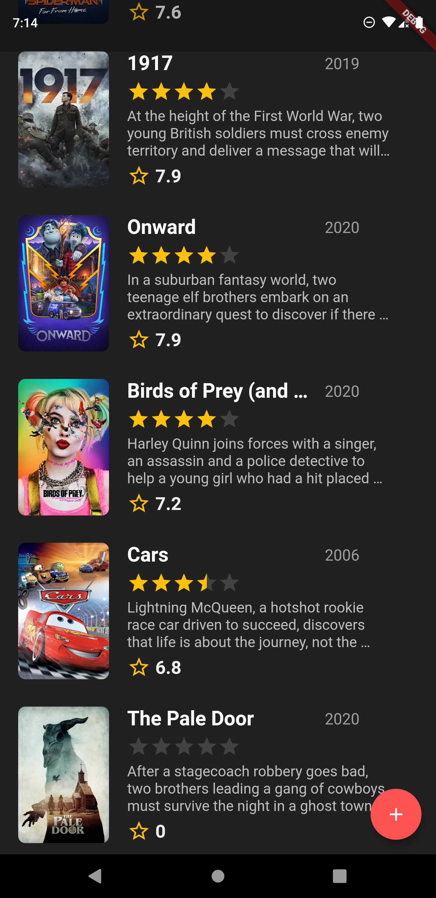
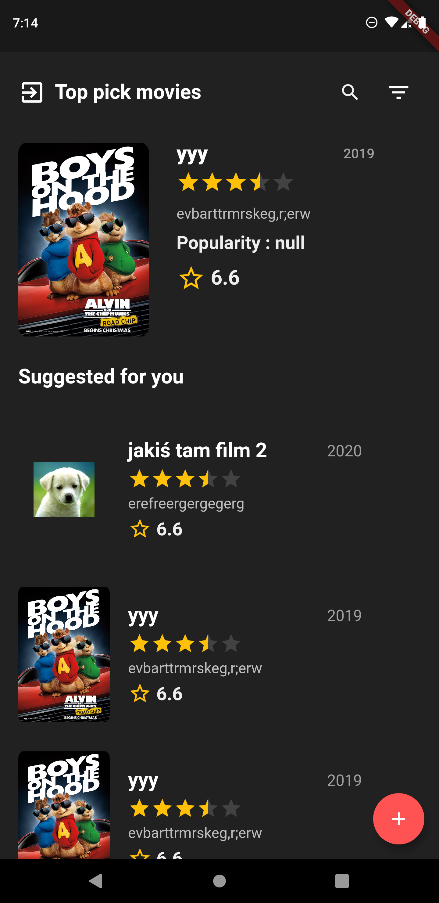
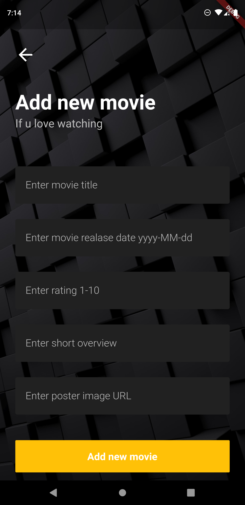

# Movies app in flutter

#### Movies App with Google auth, realtime database and THEMovieDB API

## Getting Started

#### Used features: 
- flutter material design library
- themoviedb API  [link](https://developers.themoviedb.org/3/movies/get-movie-details)
- flutter spin kit library [link](https://pub.dev/packages/flutter_spinkit)
- flutter animated text kit library [link](https://pub.dev/packages/animated_text_kit)
- flutter http library [link](https://pub.dev/packages/http)
- flutter intl library [link](https://pub.dev/packages/intl)
- flutter provider library [link](https://pub.dev/packages/provider)
- flutter firebase_database library [link](https://pub.dev/packages/firebase_database)
- flutter firebase_auth library [link](https://pub.dev/packages/firebase_auth)
- flutter flutter_rating_bar library [link](https://pub.dev/packages/flutter_rating_bar)
- flutter devicelocale library [link](https://pub.dev/packages/devicelocale)

### App was created in flutter language which is based on dart.

#### Used technology
- async tasks
- get data from api
- build listview with builder method
- used maps and lists
- used navigator component
- custom classes and widgets
- login or register with google auth
- save your own movies in google real time database firebase
- find movies and overview in your own language 

## Screenshots :

## Thanks for reading. Don't forget to star my project 
